이클립스에 `PyDev` 를 설치하며, “**Python Interpreter 설정**” 단계를 거쳤습니다.

우리가 흔히 쓰는 “**JAVA**”는 “**컴파일 한다**”라고 하는데, “**Python**”은 왜 “**인터프리터**”라고 부를까요?

(이 차이를 알면 코딩테스트에서 디버깅하는 속도가 달라집니다.)

# 1. 인터프리터(Interpreter) 란?

= “통역사”

= 프로그래밍 언어의 소스코드를 <u>바로 실행</u>하는 컴퓨터 프로그램/환경

| 컴파일러                                             | 인터프리터                                    |
| ------------------------------------------------ | ---------------------------------------- |
| 번역가                                              | 통역사                                      |
| 영어로 된 두꺼운 책(소스 코드)을 받아서, **한꺼번에** 한글 책(기계어)으로 번역 | 영어 문장을 **한 줄씩** 듣고, **그 자리에서 바로** 한글로 통역 |
| 우리는 번역된 책을 그냥 읽기만 하면 됨 → 속도가 빠름                  | 바로바로 실행                                  |

```mermaid
graph TD
    A[(📄 소스 코드 Source Code)] -->|전체 파일 입력| B(⚙️ 컴파일러 / 번역가)
    B -->|한꺼번에 번역| C[(📦 실행 파일 / 기계어 Executable)]
    C -->|실행 요청| D[(🏃 프로그램 실행 Run)]
    
    style A fill:#f9f,stroke:#333,stroke-width:2px
    style C fill:#bbf,stroke:#333,stroke-width:2px
    style B fill:#ff9,stroke:#333,stroke-width:2px
```

```mermaid
graph TD
    A[(📄 소스 코드 Source Code)] --> B{라인 단위 읽기}
    B -->|1번째 줄| C[🔄 통역 & 바로 실행]
    C --> D[✅ 결과 출력 1]
    D --> B
    B -->|2번째 줄| E[🔄 통역 & 바로 실행]
    E --> F[✅ 결과 출력 2]
    F --> B
    B -->|... 에러 발생 시 ...| G[(❌ 즉시 중단 Stop)]

    style A fill:#f9f,stroke:#333,stroke-width:2px
    style C fill:#ff9,stroke:#333,stroke-width:2px
    style E fill:#ff9,stroke:#333,stroke-width:2px
    style G fill:#f00,stroke:#333,stroke-width:2px,color:#fff
```

# 2. 자바(java) vs 파이썬(python) 실행 과정 비교

## (1) ☕ 자바 (Java): 컴파일 언어의 특징

1. `Hello.java` 파일 작성
2. 컴파일
    1. `javac` 가 전체 코드를 스캔
    2. `Hello.class` (바이트코드)로 변환
        1. 이때, 문법 에러가 있으면 <u>_실행 파일(.class) 아예 만들어주지 않음._</u>
3. 실행 - `JVM` 이 바이트코드(.class) 읽어서 실행

## [CS 기초] 바이트코드(Bytecode) 란? - 자바가 어디에서든 실행되는 비밀

자바 프로젝트를 열어봤을 때, `*.java` 파일 말고 `*.class` 라는 파일들이 생성된 것을 볼 수 있습니다. (보통 `bin` 디렉토리 안에 있습니다.)

이 `*.class` 파일을 열어보면 외계어같은 문자들이 가득한데요,

이 **`*.class`** 파일이 바로 ‘**중간 언어**’ 역할을 하는 **`바이트코드`**  입니다.

# 1. 바이트코드(Bytecode)의 정의

- **가상 머신(Virtual Machine)이 이해할 수 있는 이진 코드**
- ‘**바이트**’ 코드 인 이유 : 명령어의 크기가 “**1바이트(Byte)**” 라서!

## [CS 정복] 비트(bit)와 바이트(Byte) - 0과 1 | 네트워크, 자료형에서

컴퓨터는

- **전기가 들어오면 = 1 = TRUE**
- **전기가 안들어오면 = 0 = FALSE**

이 두가지 상태밖에 모릅니다.

이 단순한 두가지 신호가 모여서 지금의 인터넷을 만들어냅니다.

이 두가지 신호를 기반으로, **데이터의 최소 단위**부터 **네트워크 패킷의 효율**까지 - 비트와 바이트의 모든 것을 알아보아요 -

# 1. 태초에 비트(bit)가 있었다

## (1) 비트 (Bit = Binary digit)

- 정의 : 컴퓨터가 처리하는 정보의 **최소 단위**
- 값 : **`0`**(참, TRUE, ON) 또는 **`1`**(거짓, FALSE, OFF)
- 표현 가능 개수 : $2^1$ = 2개 (0 또는 1)

## (2) 바이트 (Byte)

- 정의 : 비트 8개를 묶은 것
- 표현 가능 개수 : $2^8$ **= 256개 (0~255)**

### (2)-1. 왜 8개 인가?

초창기 컴퓨터가 ‘영문자 알파벳 하나’, ‘특수문자’를 표현하는 데 (ASCII code 기준) 7-8비트가 필요했기 때문입니다. 

## [CS 역사] 초창기 컴퓨터와 아스키 코드 (ASCII) - 7비트의 경제학

오늘날 우리는 이모지(💖)부터 한글까지 수만가지 문자를 자유롭게 쓰지만, 컴퓨터의 태동기에는 _“알파벳 소문자와 대문자만이라도 제대로 주고받자”_는 것이 지상 과제였습니다.

그 시절 컴퓨터들의 모습과, 왜 7비트짜리 아스키 코드를 만들었는지 알아보아요 -

# 1. 초창기 컴퓨터: “서로 말이 안통하던 시대”

1960년대 초반, 컴퓨터 시장은 춘추전국시대였습니다.

제조사마다 문자를 저장하는 방식이 제각각이었는데요,

## (1) 📼 그 시절의 컴퓨터들 (Mainframes & Minicomputers)

### (1-1) IBM 메인프레임 (System/360)

- 당시 컴퓨터 시장의 지배자 (최초의 현대식 메인프레임)
- 1964년 4월 7일에 발표하고 1965년부터 1978년까지 출하한 **메인프레임 컴퓨터 시스템 계열**
- 상업용, 과학용 목적을 포함한 완전한 범위의 초기 다목적 컴퓨터
- 1964년에 발표된 가장 느린 시스템/360 모델인 모델 30은 초 당 최대 34,500개의 명령을 수행할 수 있었으며, 메모리는 8~64 KB에 달함

> **“메인프레임”**   
> ## [IT 트렌드] 메인프레임(Mainframe) - 기술 공룡인가? 이끌어갈것인가?  
>   
> - 초기 컴퓨터 시스템의 **중앙 처리 장치(CPU)를 보관하던 대형 캐비닛** 또는 '메인 프레임'을 가리킴  
>   
> - 조직의 데이터 처리 센터에 있는 워크스테이션  
>   
> - 터미널을 연결하는 중앙 데이터 저장소 또는 '허브' 역할  
>   
> - 메인프레임이 더 작아지고 처리 능력이 향상되어 유연성과 다목적성이 높아지면서 **중앙 집중식 컴퓨팅 환경**이 보다 **분산된 컴퓨팅 환경**으로 바뀌고 있음  
>   
> - 오늘날의 메인프레임은 대량의 데이터를 처리하고 저장하며 엔터프라이즈 서버(또는 데이터 서버)라고 불림

출처
[https://www.ibm.com/kr-ko/think/topics/mainframe
](https://www.ibm.com/kr-ko/think/topics/mainframe)[https://ko.wikipedia.org/wiki/IBM_시스템/360](https://ko.wikipedia.org/wiki/IBM_%EC%8B%9C%EC%8A%A4%ED%85%9C/360)

### (1-2) 텔레타이프(Teletype) 머신

### (1-3) DEC 

> - 소스 코드 (**`*.java`**) : 사람이 이해하는 언어 (**High-Level**)  
>   
> - 바이트 코드 (**`*.class`**) : 중간에 있는 언어 (**Interpreter**)  
>   
> - 기계어 (Machine Code) : CPU가 이해하는 0과 1 (**Low-Level**)

